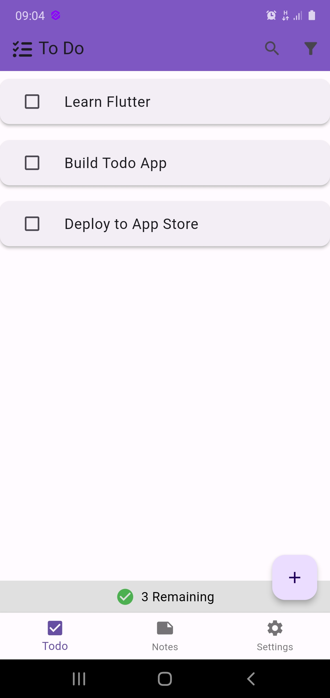
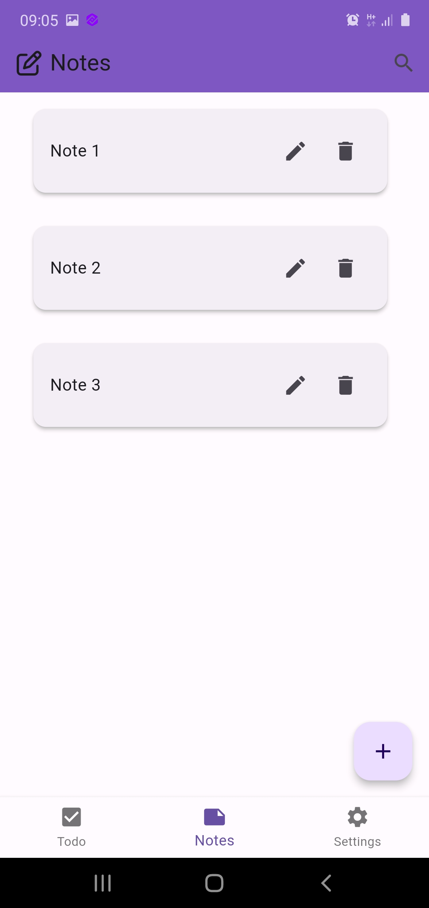
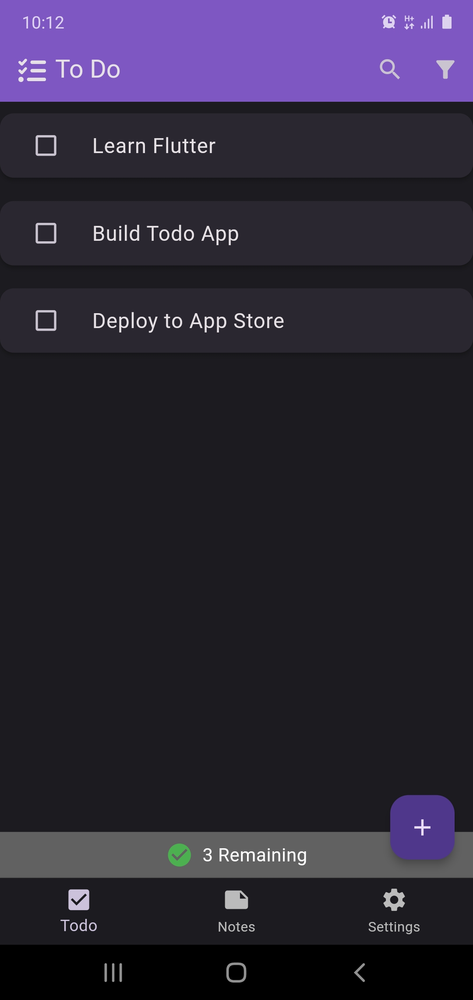
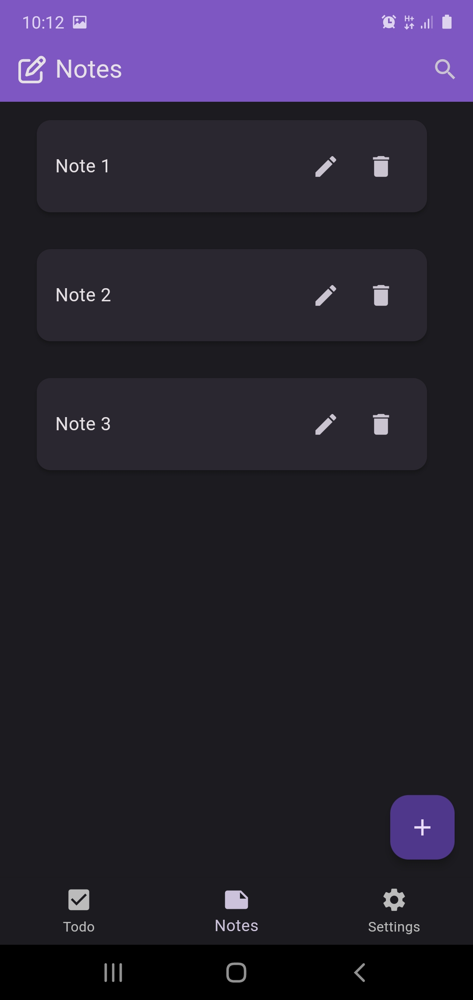
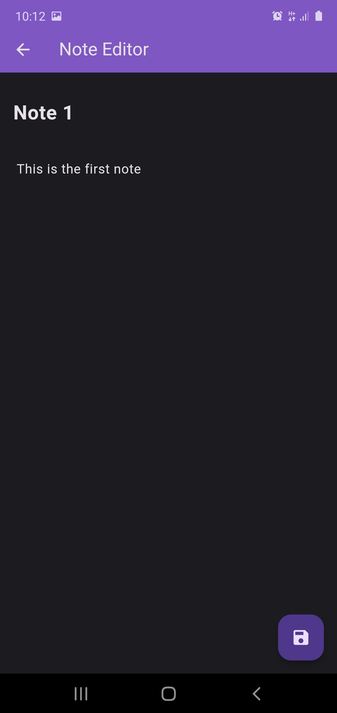

# MyNote

MyNote is a simple application developed using Flutter that combines note-taking and task management functionalities in one app.

## Features

### MyNote

- Create new notes with titles and content.
- Edit existing notes.
- Delete notes.
- Dark mode support.
- User-friendly interface.

### ToDo

- Create new tasks.
- Edit existing tasks.
- Delete tasks.
- Mark tasks as completed.
- Dark mode support.
- User-friendly interface.

## Screenshots

 
 
 

## Getting Started

To run the MyNote locally, follow these steps:

1. Ensure you have Flutter installed on your machine. If not, you can follow the installation instructions [here](https://flutter.dev/docs/get-started/install).
2. Clone this repository to your local machine.
3. Open the project in your preferred IDE (e.g., Visual Studio Code).
4. Run `flutter pub get` to install dependencies.
5. Connect a device or start an emulator.
6. Run `flutter run` to launch the app.

## Dependencies

- [Flutter SDK](https://flutter.dev/)
- [font_awesome_flutter](https://pub.dev/packages/font_awesome_flutter) - For FontAwesome icons.

## Contributing

Contributions are welcome! If you encounter any issues or have suggestions for improvements, feel free to open an issue or submit a pull request.

## License

This project is licensed under the MIT License - see the [LICENSE](LICENSE) file for details.
